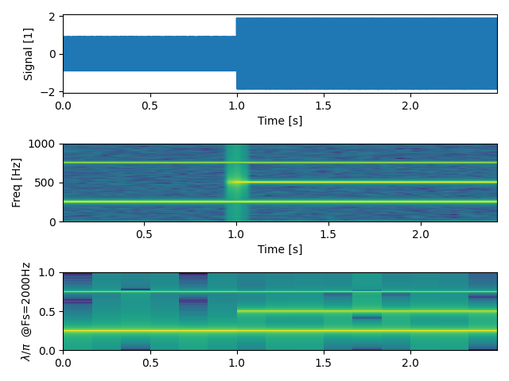

# Python Tutorial for Discrete Time Signal Processing Tasks 
## (ECHTZEITDATENVERARBEITUNG)
The following tasks are implemented:
- spectrogram
  
- linear convolution (numpy)
- circular convolution

